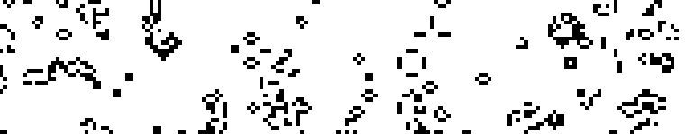

# gameoflife

A simple implementation of [Conway's Game of Life](https://en.wikipedia.org/wiki/Conway%27s_Game_of_Life) written in [Futhark](http://futhark-lang.org) using the [lys](https://github.com/diku-dk/lys) library for graphics and interaction.

Requires Futhark and SDL2 and SDL2-ttf libraries with associated header files.

## Building and running

First run `futhark pkg sync` once.

Then run `make run` to build and run in a window.

## Controls

  - Click to create a 2*2 block of living cells.
  - Change the game speed with `+` and `-`.
  - Zoom with the scroll wheel.
  - Pan with the arrow keys.
  - Pause with the space bar.
